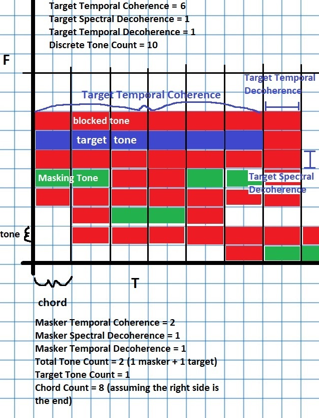

# PART Multiburst

This is a rough overview of the current state of the Multiburst stimuli in PART.

## Correspondence

### Frederick Gallun - May 26, 2018

> Hi Trevor,
>
> I think you sent an explanation of what the parameters do in multiburst, but I can’t find it and I’m having trouble recreating some of the basic tasks on the iPad. Can you tell me what values would create the stimuli in this paper?
>
> <http://www.cns.bu.edu/~shinn/resources/pdfs/2008/2008JASA_Gallun.pdf>
>
> Thanks!  
> *Erick*

### Trevor Stavropoulos - May 29, 2018

> Hey Erick,
>
> I’ve made the closest approximation that I can given the current burst tools.
>
> Since Target Tone ITD and ILD isn’t currently controllable, that doesn’t exist yet.
>
> I’ve focused this reproduction on the mechanics of the tone masker and noise masker.
>
> For linearly distributed tones between 100 and 1000 hz with a spacing of 1Hz, there are 901 tones.
>
> The target tone is at 500Hz, and needs to block out +/- 100hz, so it has a proctective spectral decoherence of 100 tones.
>
> Currently, this model doesn’t enforce that half of the masking tones end up below and half above the target, it merely statistically tends to do so.  This statistical pattern could be greater reinforced by adding some tone blocking around each masker as well, (spectral decoherence), but that also affects the distribution, so I opted not to.
>
> I intend to introduce tools down the line that will allow for greater control of the distribution.
>
> Let me know if you have any questions about this implementation.  
> *Trevor*

### Gallun Multiburst

```JSON
{
    "Type": "Custom",
    "AssessmentName": "Gallun Multiburst",
    "Stimulus": {
        "Type": "MultiBurst",
        "Task Configuration": {
            "Type": "Four Interval",
            "InterstimInterval": 250,
            "MinStimInterval": 500,
            "Intertrial Interval": {
                "Type": "Fixed",
                "Value": 1000
            }
        },
        "Testing Features": {
            "Type": "Default",
            "DisplayParams": false
        },
        "Stimulus Level": {
            "Type": "Fixed",
            "Value": 80,
            "Standard Behavior": {
                "Type": "Mirrored"
            }
        },
        "PeriStimulus Buffer": {
            "Type": "Default",
            "Value": 50
        },
        "Presentation": {
            "Type": "Fixed Lateralization",
            "Value": "Both"
        },
        "Chord Count": {
            "Type": "Fixed",
            "Value": 1,
            "Standard Behavior": {
                "Type": "Mirrored"
            }
        },
        "InterChord Interval": {
            "Type": "Fixed",
            "Value": 0
        },
        "Chord Duration": {
            "Type": "Fixed",
            "Value": 250,
            "Standard Behavior": {
                "Type": "Mirrored"
            }
        },
        "Chord Window": {
            "Type": "Default",
            "WindowingFunction": "Hamming",
            "WindowSkirt": 10
        },
        "Chord Tone Count": {
            "Type": "Fixed",
            "Value": 20,
            "Standard Behavior": {
                "Type": "Mirrored"
            }
        },
        "Tone Composition": {
            "Type": "Default",
            "ToneDistribution": "Linear",
            "DiscreteToneCount": 901,
            "LowerBound": 100,
            "UpperBound": 1000
        },
        "Target\/Masker Tone Level Ratio": {
            "Type": "Adaptive",
            "Initial": 10,
            "Min": -100,
            "Max": 100
        },
        "Target Composition": {
            "Type": "Target Frequency",
            "Value Behavior": {
                "Type": "Fixed",
                "Value": 500
            }
        },
        "Target Tone Coherence": {
            "Type": "Fixed",
            "Value": 10
        },
        "Target Protective Decoherence": {
            "Type": "Fixed",
            "DecoherencePattern": "Rectangular",
            "TemporalDecoherence": 0,
            "SpectralDecoherence": 100
        },
        "Masking Tone Properties": {
            "Type": "Default",
            "IntervalMirroring": "TargetExclusion"
        },
        "Masking Tone Coherence": {
            "Type": "Fixed",
            "Value": 0
        },
        "Masking Tone Decoherence": {
            "Type": "Fixed",
            "DecoherencePattern": "Rectangular",
            "TemporalDecoherence": 1,
            "SpectralDecoherence": 0
        },
        "Masker": {
            "Type": "Noise",
            "FrequencyDistribution": "Linear",
            "LowerBound": 100,
            "UpperBound": 1000,
            "CarrierCount": 901,
            "AmplitudeDistribution": "FlatRandom",
            "AmplitudeFactor": "White",
            "Presentation": {
                "Type": "Binaural"
            },
            "SNR": {
                "Type": "Adaptive",
                "Initial": 10,
                "Min": -20,
                "Max": 20
            }
        },
        "MaskerB": {
            "Type": "Disabled"
        },
        "Masker Window": {
            "Type": "Default",
            "Windowing Function": {
                "Type": "Hamming",
                "Value": 10
            }
        }
    },
    "Algorithm": {
        "Type": "Simple Staircase",
        "Reversals": 12,
        "CorrectToStepDown": 3,
        "WrongToStepUp": 2,
        "StepsUp": 2,
        "StepsDown": 1,
        "Templates": [
            {
                "Type": "Target\/Masker Tone Level Ratio",
                "AlgorithmSlot": "StaircaseParameter",
                "StepDownBehavior": "DecreaseParameter",
                "Step Template": {
                    "Type": "Linear",
                    "BaseStepSize": 0.100000001490116
                }
            },
            {
                "Type": "SNR",
                "AlgorithmSlot": "StaircaseParameter",
                "StepDownBehavior": "DecreaseParameter",
                "Step Template": {
                    "Type": "Linear",
                    "BaseStepSize": 0.100000001490116
                }
            }
        ]
    },
    "Version": 6
}
```

### Trevor Stavropoulos - May 29, 2018 - Continued

> Some of the terminology was borrowed/adapted from Shamma’s big multiburst paper <https://www.ncbi.nlm.nih.gov/pmc/articles/PMC3721234/>
>
> I’ve attached an image that should hopefully shed some light on the description.
>
> Mirroring Target Exclusion means that the protective region around the target interval is Copied to the non-target interval.  This way, the non-target interval won’t populate the target tone’s region.
>
> Use the attached assessment instead, as I had to add a small fix to prevent PART from generating an error if you ask for a target with a spectral coherence larger than the number of tones.
>
> The idea is that a “chord” is a burst of several tones.  When generating our target, and then later our maskers:
>
> First, we figure out how many Chords (tone bursts) will be required, and we divide our Frequency domain into discrete tones following the description provided in the Tone Composition section, creating an effective Grid of tones vs chords (Freq vs time).
>
> Then, we select where the target tones are to appear.  If the target sequence has a lower temporal coherency than the total number of chords (as is the case in Shamma’s chord paradigm, but not in MBS or MBD), then we figure out which chord the tone should start/end on.  We also select the frequency/frequencies of the target tone(s).  We mark off the appropriate grid spaces as a RenderedTone, and the surrounding tone spaces as Blocked, in accordance with the Spectral/Temporal decoherence values.  If we have a spectral decoherence value of 10 tones, then the 10 tone slots above and below each target tone will be unavailable for masker selection.
>
> This process then repeats for the masking tones.
>
> I realize there is a small inconsistency I need to fix in how it’s described in the program.  For Target Tones, temporal coherency means “How many consecutive chords feature the target tone”.  If this value is set to 3, the target tone will appear in 3 consecutive chords.
>
> For Maskers, temporal coherency means “How many additional consecutive chords feature the masker”, meaning if this value is set to 3, each masking tone will last 4 consecutive chords (3 additional on top of the 1 default).  That is, if you want every chord to have a completely fresh “draw” of masking tones, this value should be set to 0.  And if you want to further guarantee that no masking tone is the same between two adjacent chords, you would set the temporal decoherence to 1.
>
> 
>
> Expanding on my note about the inconsistency, the actually value for Masker Temporal Coherency that corresponds to the graph is 1, not 2.

### Trevor Stavropoulos - May 29, 2018 - Continued 2

> I’m pushing a new update to PART, it should be available in a little bit.
>
> It fixes the coherency issue I mentioned, making temporal coherency = 1 meaning the tone is present in only one chord.  It also catches and fixes some errors related to setting the temporal coherency > the number of chords.

### Trevor Stavropoulos - September 6th, 2018

> For this task, you just want the target beeps in the target interval, and silence otherwise, right?
>
>First, it’s best to avoid just setting the things you want silent to 0db, because they’re still rendered, just very quietly.  If there were 8 masking tones rendered at 0db Each, that actually makes the maskers cumulatively at about 9dB, plus that would get screwed up with Total Stim Level Scaling.
>
> So set the Chord Tone Count to 1 tone.  – As you only want to play one tone.
>
> Under Masking Tone Properties:
> Set Interval Mirroring to “Target Exclusion”.  This tells all the standard intervals to block out the tones that were generated for use by the Target tones.  It also counts against their allotment of “1 tone”, meaning there are 0 left.
>
> Set Total Stimulus Level Scaling to 35 db.  This should effectively not change the level of the stimulus, since it’s just a beeping at 35db, but in reality it will make it slightly louder since the RMS level of multiburst is slightly lower than 35db due to the periods of silence and ramping.
>
>
> #### Small adjustments to the MBS and MBD.
>
> You want half of the masking tones above, and half below, the target tone.  First, because of various elements of the procedure, it’ll work best if the target tone (1kHz) is right in the middle of our target tone range.  This isn’t necessary, but it will make the system better behaved.
>
> Tone Composition:  
> Tone Distribution: Exponential  
> Discrete Tone Count: 201  
> FreqLB: 125 Hz  
> FreqUB: 8000 Hz
>
> The Target Protective Decoherence will block other tones from getting too close to the frequency of the Target tone.  40 tones means the 40 slots above and 40 slots below (as defined by the tone composition above) are marked unavailable for maskers.  That’s about (80 blocked tones)/(200 total tones) * 6 total octaves = 2.4 octaves, or 1.2 octaves in each direction that are excluded.  Perhaps a bit much?
>
> For Masking Tone Properties, the interval mirroring is correctly set to Target Exclusion for MBD, but we want to turn on control over the Masker Distribution.  Set Masker Distribution to Even Partitions, 1 partition.  This splits the possible Tones into two sections (ie 1 partition in the middle), and forces even distribution between them.  This lands right on the target tone.
>
> For MBS, we want the same, except Interval Mirroring needs to be “Masker Selection”.
>
> Under Masking Tone Decoherence, you’re going to want to set Spectral Decoherence to something very small, like 0.  This is how far apart the masking tones force eachother to be, and having a value of 40 is why the spectrogram is currently giving you kind of what you want, but not really, and not guaranteed.

### MultiBurstSame_Kidd_2
```JSON
{
    "Type": "Custom",
    "AssessmentName": "MultiBurstSame_Kidd_2",
    "Stimulus": {
        "Type": "MultiBurst",
        "Task Configuration": {
            "Type": "Four Interval",
            "InterstimInterval": 250,
            "MinStimInterval": 500,
            "Intertrial Interval": {
                "Type": "Fixed",
                "Value": 1000
            }
        },
        "Testing Features": {
            "Type": "Default",
            "DisplayParams": true
        },
        "PeriStimulus Buffer": {
            "Type": "Default",
            "Value": 50
        },
        "Presentation": {
            "Type": "Fixed Lateralization",
            "Value": "Both"
        },
        "Chord Count": {
            "Type": "Fixed",
            "Value": 8,
            "Standard Behavior": {
                "Type": "Mirrored"
            }
        },
        "InterChord Interval": {
            "Type": "Fixed",
            "Value": 0
        },
        "Chord Duration": {
            "Type": "Fixed",
            "Value": 60,
            "Standard Behavior": {
                "Type": "Mirrored"
            }
        },
        "Chord Window": {
            "Type": "Default",
            "WindowingFunction": "Hamming",
            "WindowSkirt": 10
        },
        "Chord Tone Count": {
            "Type": "Fixed",
            "Value": 3,
            "Standard Behavior": {
                "Type": "Mirrored"
            }
        },
        "Tone Composition": {
            "Type": "Default",
            "ToneDistribution": "Exponential",
            "DiscreteToneCount": 201,
            "LowerBound": 125,
            "UpperBound": 8000
        },
        "Target Tone Level(s)": {
            "Type": "Simple Level",
            "Tone Level": {
                "Type": "Fixed",
                "Value": 35
            }
        },
        "Total Target Level Scaling": {
            "Type": "Disabled"
        },
        "Target ITD": {
            "Type": "Disabled"
        },
        "Target Composition": {
            "Type": "Target Frequency",
            "Value Behavior": {
                "Type": "Fixed",
                "Value": 1000
            }
        },
        "Target Tone Coherence": {
            "Type": "Fixed",
            "Value": 8
        },
        "Target Protective Decoherence": {
            "Type": "Fixed",
            "DecoherencePattern": "Rectangular",
            "TemporalDecoherence": 0,
            "SpectralDecoherence": 40
        },
        "Masking Tone Properties": {
            "Type": "Default",
            "IntervalMirroring": "MaskerSelection",
            "Masker Distribution": {
                "Type": "Even Partitions",
                "Value": 1
            }
        },
        "Masker ITD": {
            "Type": "Disabled"
        },
        "Masker Tone Level(s)": {
            "Type": "Simple Level",
            "Tone Level": {
                "Type": "Adaptive",
                "Initial": 5,
                "Min": -40,
                "Max": 90
            }
        },
        "Total Masker Level Scaling": {
            "Type": "Disabled"
        },
        "Masking Tone Coherence": {
            "Type": "Fixed",
            "Value": 8
        },
        "Masking Tone Decoherence": {
            "Type": "Fixed",
            "DecoherencePattern": "Rectangular",
            "TemporalDecoherence": 0,
            "SpectralDecoherence": 0
        },
        "Total Stimulus Level Scaling": {
            "Type": "Disabled"
        },
        "Masker": {
            "Type": "Disabled"
        },
        "MaskerB": {
            "Type": "Disabled"
        },
        "Masker Window": {
            "Type": "Default",
            "Windowing Function": {
                "Type": "Hamming",
                "Value": 10
            }
        }
    },
    "Algorithm": {
        "Type": "Staged Staircase",
        "CorrectToStepDown": 2,
        "WrongToStepUp": 1,
        "Stages": {
            "Type": "2Stages",
            "Stage2Reversals": 4,
            "Stage2StepsUp": 1,
            "Stage2StepsDown": 1,
            "Stage1Reversals": 4,
            "Stage1StepsUp": 2,
            "Stage1StepsDown": 2
        },
        "Templates": [
            {
                "Type": "Tone Level",
                "AlgorithmSlot": "StaircaseParameter",
                "StepDownBehavior": "IncreaseParameter",
                "Threshold": "MaskLevelMBS",
                "Step Template": {
                    "Type": "Linear",
                    "BaseStepSize": 3
                }
            }
        ]
    },
    "Version": 6
}
```

### MultiBurstDifferent_Kidd_2

```JSON
{
    "Type": "Custom",
    "AssessmentName": "MultiBurstDifferent_Kidd_2",
    "Stimulus": {
        "Type": "MultiBurst",
        "Task Configuration": {
            "Type": "Four Interval",
            "InterstimInterval": 250,
            "MinStimInterval": 500,
            "Intertrial Interval": {
                "Type": "Fixed",
                "Value": 1000
            }
        },
        "Testing Features": {
            "Type": "Default",
            "DisplayParams": true
        },
        "PeriStimulus Buffer": {
            "Type": "Default",
            "Value": 50
        },
        "Presentation": {
            "Type": "Fixed Lateralization",
            "Value": "Both"
        },
        "Chord Count": {
            "Type": "Fixed",
            "Value": 8,
            "Standard Behavior": {
                "Type": "Mirrored"
            }
        },
        "InterChord Interval": {
            "Type": "Fixed",
            "Value": 0
        },
        "Chord Duration": {
            "Type": "Fixed",
            "Value": 60,
            "Standard Behavior": {
                "Type": "Mirrored"
            }
        },
        "Chord Window": {
            "Type": "Default",
            "WindowingFunction": "Hamming",
            "WindowSkirt": 10
        },
        "Chord Tone Count": {
            "Type": "Fixed",
            "Value": 3,
            "Standard Behavior": {
                "Type": "Mirrored"
            }
        },
        "Tone Composition": {
            "Type": "Default",
            "ToneDistribution": "Exponential",
            "DiscreteToneCount": 201,
            "LowerBound": 125,
            "UpperBound": 8000
        },
        "Target Tone Level(s)": {
            "Type": "Simple Level",
            "Tone Level": {
                "Type": "Fixed",
                "Value": 35
            }
        },
        "Total Target Level Scaling": {
            "Type": "Disabled"
        },
        "Target ITD": {
            "Type": "Disabled"
        },
        "Target Composition": {
            "Type": "Target Frequency",
            "Value Behavior": {
                "Type": "Fixed",
                "Value": 1000
            }
        },
        "Target Tone Coherence": {
            "Type": "Fixed",
            "Value": 8
        },
        "Target Protective Decoherence": {
            "Type": "Fixed",
            "DecoherencePattern": "Rectangular",
            "TemporalDecoherence": 0,
            "SpectralDecoherence": 40
        },
        "Masking Tone Properties": {
            "Type": "Default",
            "IntervalMirroring": "TargetExclusion",
            "Masker Distribution": {
                "Type": "Even Partitions",
                "Value": 1
            }
        },
        "Masker ITD": {
            "Type": "Disabled"
        },
        "Masker Tone Level(s)": {
            "Type": "Simple Level",
            "Tone Level": {
                "Type": "Adaptive",
                "Initial": 5,
                "Min": -40,
                "Max": 90
            }
        },
        "Total Masker Level Scaling": {
            "Type": "Disabled"
        },
        "Masking Tone Coherence": {
            "Type": "Fixed",
            "Value": 1
        },
        "Masking Tone Decoherence": {
            "Type": "Fixed",
            "DecoherencePattern": "Rectangular",
            "TemporalDecoherence": 0,
            "SpectralDecoherence": 0
        },
        "Total Stimulus Level Scaling": {
            "Type": "Disabled"
        },
        "Masker": {
            "Type": "Disabled"
        },
        "MaskerB": {
            "Type": "Disabled"
        },
        "Masker Window": {
            "Type": "Default",
            "Windowing Function": {
                "Type": "Hamming",
                "Value": 10
            }
        }
    },
    "Algorithm": {
        "Type": "Staged Staircase",
        "CorrectToStepDown": 2,
        "WrongToStepUp": 1,
        "Stages": {
            "Type": "2Stages",
            "Stage2Reversals": 4,
            "Stage2StepsUp": 1,
            "Stage2StepsDown": 1,
            "Stage1Reversals": 4,
            "Stage1StepsUp": 2,
            "Stage1StepsDown": 2
        },
        "Templates": [
            {
                "Type": "Tone Level",
                "AlgorithmSlot": "StaircaseParameter",
                "StepDownBehavior": "IncreaseParameter",
                "Threshold": "MaskLevel",
                "Step Template": {
                    "Type": "Linear",
                    "BaseStepSize": 3
                }
            }
        ]
    },
    "Version": 6
}
```