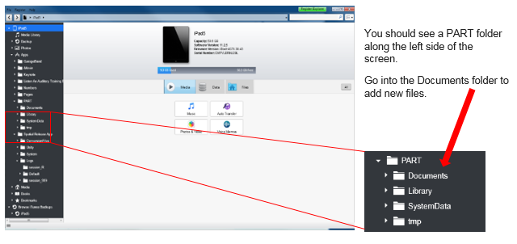
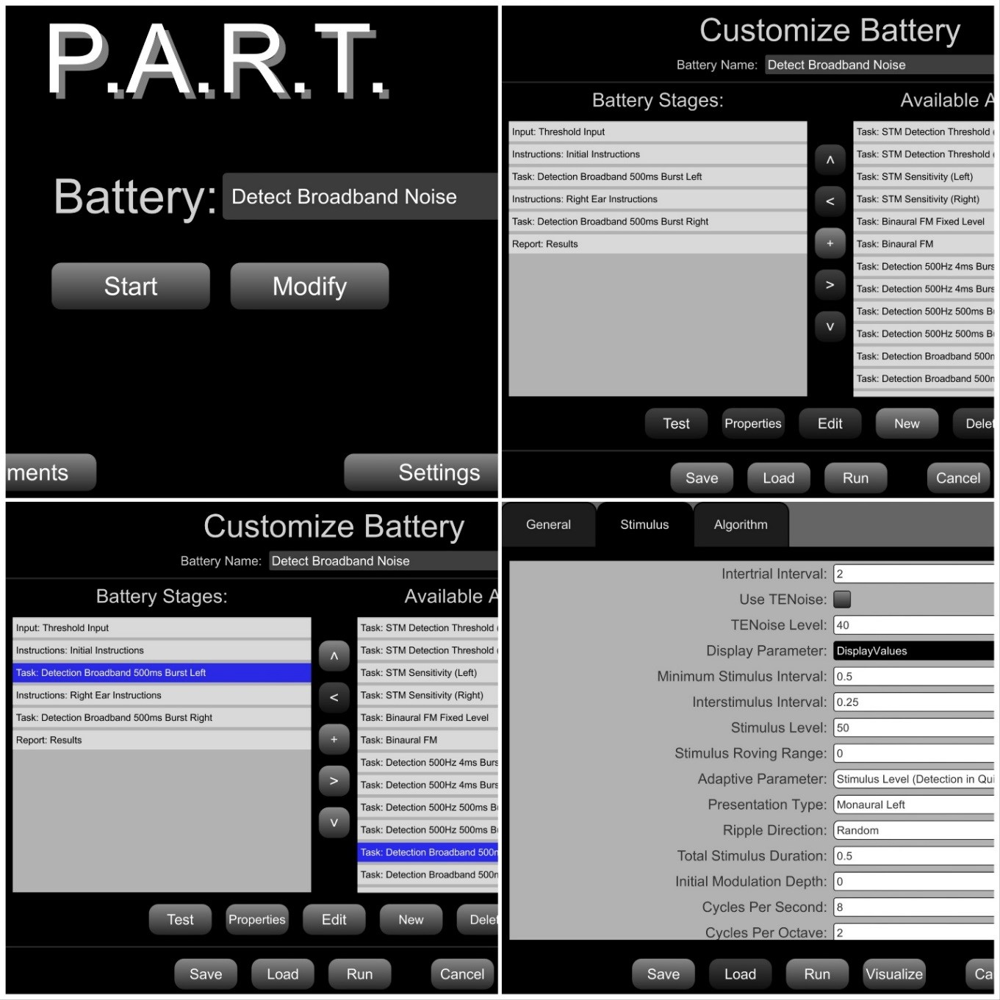
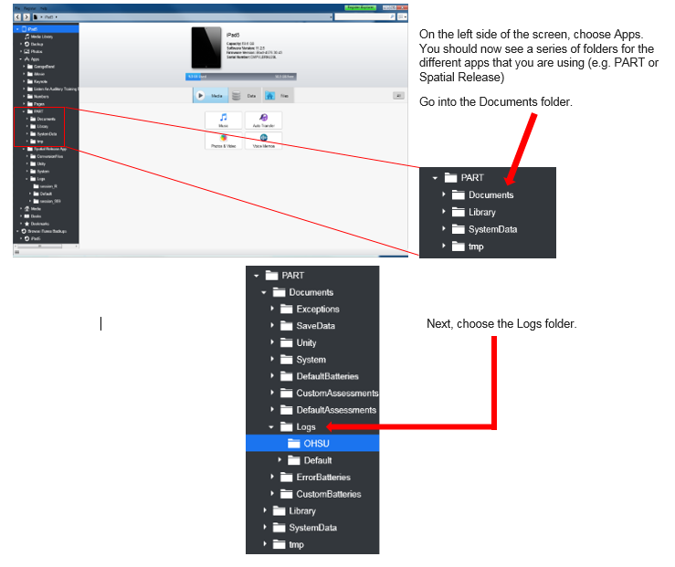
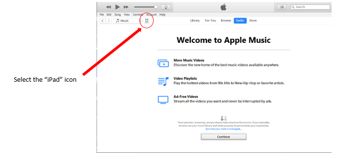
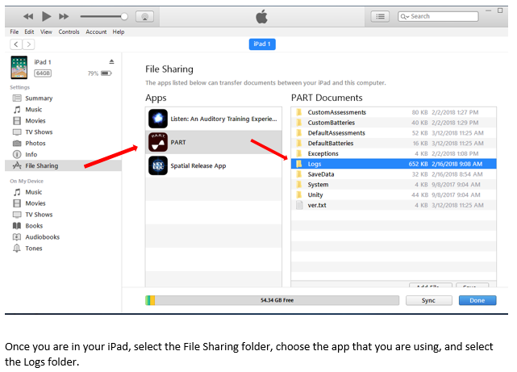
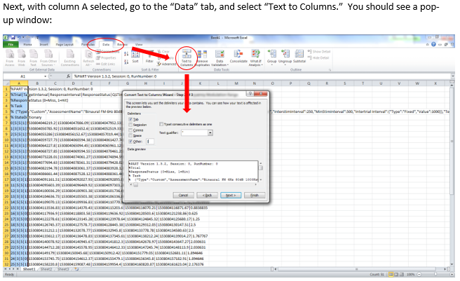
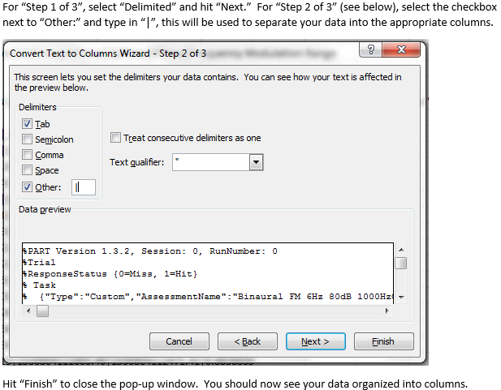

# PARTial Programming Guide

*Date: August 19, 2022*

These instructions refer to the App Store version of PART (2.6.0)

**Welcome to the Portable Automated Rapid Test (PART) platform for psychoacoustical testing!**

This guide will help you use PART to conduct your experiments. Everything you will need to know to get started using PART will be covered in the following six sections:

* [Section One](#section-one-introduction-to-part): A brief introduction to the elements of PART
* [Section Two](#section-two-calibration-procedures): Calibration procedures
* [Section Three](#section-three-uploading-and-downloading-assessments-and-batteries): How to upload and download Assessments and Batteries
* [Section Four](#section-four-programming-your-own-assessments-and-batteries): How to program your own Battery and new Assessments
* [Section Five](#section-five-exporting-saved-data): How to export data
* [Section Six](#section-six-selected-references): References upon which these Assessments were based on from which appropriate parameter values can be obtained

## Section One: Introduction to PART

A full introduction to PART can be found here: <http://bgc.ucr.edu/games/part/>

To get started, download PART from the Apple iTunes app store: <https://itunes.apple.com/us/app/p-a-r-t/id1126512332?mt=8>

PART is designed to present one or more customizable “Assessments” arranged in a customizable “Battery”. A set of prepared default assessments and batteries included in the application. These default sets cannot be altered, but modified versions can be saved with new names and new sets of parameters and batteries can be created and saved. Data are saved to the iPad and are not transmitted to any other location. To access the saved data, iTunes or other software can be used to share the files for custom assessments and batteries as well as logs of user data. Calibration of PART (see Section Two) can be easily conducted using external equipment capable of measuring the precise output of the iPad (i.e., a sound level meter and flat plate coupler).

Complete details on the use of the application are continually being updated and are routinely made available through the iPad Psychophysics Users Group (iPUG). Interested users should email fgallun@gmail.com to be added to the group.

### Assessments and Batteries

PART is continually being upgraded and at this time includes assessment tools that can be used to measure the following abilities:

* *Temporal Sensitivity* — Temporal Envelope Amplitude Modulation and Temporal Envelope Gap
* *Spectral Sensitivity* — Spectral Envelope Modulation and Frequency Modulation
* *Spectrotemporal Sensitivity* — Spectrotemporal Modulation
* *Binaural Sensitivity* — Interaural Gap; Pure Tone Phase Shift; Binaural Frequency Modulation
* *Spatial Release from Speech on Speech Masking*
* *Informational Masking* — Multiple Burst Paradigm

At this time, only a single default Battery is included, which presents limited instructions and examples and includes three of the assessments described above: Binaural Frequency Modulation Detection, Temporal Envelope Gap Discrimination, and Spectrotemporal Modulation Detection. For references related to the assessments provided, see the references in **Section Six**.

A recent modification to reduce the download time is that Study Batteries, Server Code Batteries, CRM English Talkers, CRM Spanish Talkers, TENoise, Dichotic Sentences English, Dichotic Sentences Spanish, Sequence Digits English, Sequence Digits Spanish, ACT Audio and Images, AVDAT English Audio, AVDAT Spanish Audio, Letter Number Audio, and ER40 Images are now available as optional downloads. To access them, immediately after installing PART, to go to the Modules screen and download all optional modules. A screenshot of where the Modules tab can be found on the Settings screen is shown below. To get to the settings screen, tap the Settings button on the main screen, shown in **Figure 1a**.
  

*Figure 1a. PART Start Screen*

*Figure 1b. Settings Menu screen*

*Figure 1c. Modules Tab*

## Section Two: Calibration Procedures

Calibration is a crucial step in the use of PART. The goal of the calibration is to ensure that the sound levels output are consistent with the decibel (dB) values shown in the app and recorded in the log files. The general method involves playing a calibration signal (usually a 1000 Hz tone) at a known internal root mean square (RMS) level and measuring the level of that tone at the output of the transducer chain (this will usually be the headphones you will use for testing, plugged into the auxiliary jack of the iPad or iPhone). The application then provides the ability to input the dB level measured, using a calibrated system (usually a sound level meter). PART then adjusts the internal scaling so that signals of that internal RMS are associated with the measured dB level rather than the default value. Verification of this adjustment can then be made through the app. When the measured level is the same as the nominal level, the system is defined to be “calibrated”. Below are detailed instructions specific to PART.

### Step 1. Select User and Initialize Calibration

* Close PART completely if it is running by double-tapping the home button and swiping up on the PART app.
* Reopen PART, which will reveal the “Select User” screen.
* Select a User, or create a new one if none is available.
  * Tap the “Settings” button in the bottom right of the Main Menu screen (See **Figure 1a**).
  * Tap the “Unlock” button.
  * Enter the unlock code: 3141, and tap “Confirm”. This will reveal the “Select User”, “Sound Verification”, and “Calibration” tabs (see **Figure 2**).
  * Tap the “Sound Verification” tab, which will reveal the screen shown in **Figure 1b**. If the Calibration Source does not read “Default Profile”, tap the “Reset” button.

  
*Figure 2. PART Sound Verification Screen*

### Step 2. Assemble the Calibration Hardware

Assembling the calibration hardware involves plugging transducers into the device and placing a microphone in the proper orientation to record the output signal. The microphone should be attached to a sound level meter (SLM). For laboratories with professional SLM equipment, follow the laboratory protocol. We have found that in general, a new iPad with new HD 280Pro headphones measures about 5 dB lower on the SLM than the intended output.

If calibration cannot be conducted routinely using laboratory equipment, we have verified that an iBoundary microphone attached to an iPad running the NIOSH SLM app can provide the appropriate calibration. Note, however, that the NIOSH SLM needs to first be calibrated in the laboratory with the external microphone attached, so this may only be of use for field calibration or spot checking. **Figure 3** shows this setup.

   
*Figure 3a. Calibration with NIOSH SLM app running on second iPad and iBoundary microphone*  
*Figure 3b. Calibration with NIOSH SLM app, showing microphone underneath headphones*

### Step 3. Measure the Calibration Signal

* Select the “Calibration” tab, which will reveal the screen shown in **Figure 4**.
* Measure the sound by pressing “Play” (making sure that the Left earphone is on the microphone when Test Channel reads “Left”) and enter the measured level in the “Measured Level” box.
* Tap “Submit” and then tap “Next”.
* Proceed through measuring 60 and 80 dB for the left and right channels. Then, tap “Finish”.
* The screen will move to the “Sound Verification” screen (**Figure 2**). Tap “Save Calibration”.
* Now the Calibration Source will read “Active Profile”.

To verify the calibration, select a range of Presentation Levels and Test Channels and tap the Play button. The measured sound should match the Presentation Level. If this occurs, the system is calibrated. If not, repeat Step 3. To begin testing, choose the Select User tab and select a user, which will reveal the main menu (**Figure 1a**).

  
*Figure 4. PART Calibration Screen*

## Section Three: Uploading and Downloading Assessments and Batteries

PART comes with a set of default test assessments and batteries, but it can also be modified to change nearly every parameter of interest. There are two ways to change what is available: downloading files from Dropbox; or, creating or modifying assessments and batteries from within PART.

### Downloading Assessments and Batteries

A folder has been uploaded to Dropbox that contains the Custom Assessments and Custom Batteries that we are testing, so you can add them to PART and try them out. You will need to download new “Custom Battery” and “Custom Assessment” files from this Dropbox folder and copy them onto the iPad using a program such as iExplorer.

<http://tiny.cc/PART>

### To Install iExplorer

Start by downloading and installing the iExplorer 3.9.11 application on your Mac or Windows computer. Then double-click the icon to open iExplorer.

  
*Figure 5*

When you open iExplorer, be sure to click the “Continue in Demo Mode” button.

The application will open, and if your iPad is connected, you will see the files on the iPad. If it is not connected, you will need to open iTunes and use it to connect your computer to your iPad, which involves inputting the unlock code so they will trust each other.

### To Add ‘Custom Assessments’ and ‘Custom Batteries’

Go into the Documents folder and add them to the Custom folders you'll find there (**Figure 6**).

  
*Figure 6*

### Creating and Modifying Assessments and Batteries within PART

You can also just go into PART and modify an existing battery or create a new battery.

#### To create a new Battery

Tap the pulldown menu on the Menu screen and select \<\<New Battery\>\>, then tap the Modify Button. This will take you to the Customize Battery screen. **Figure 7** shows this for an existing battery.

#### To change an existing Battery or create a new one from scratch

Choose Assessments from the “Available Assessments” list and use the \< and \> arrows to move them in and out of the Batteries. The ^ and v buttons can be used to change where they occur in the list. The + button adds one of five different special types: Instruction screen, Input values screen, Variable Modifier Stage, Break, and Report Screen. To see how each is used, choose an existing battery, tap the “Modify” button, choose a Battery stage (it will highlight when you tap it), and choose “Edit” to see how it can be set up.

#### To modify an existing Battery

Batteries consist of multiple stages, some of which are “Assessments”. Editing an existing assessment will change it for all batteries in which it is included, so it is best to save it with a new name if you intend to use the original as well.

#### To modify an existing Assessment

**Figure 7** below illustrates an example of modifying an assessment.

* First, open the “Detect Broadband Noise” Battery by tapping the Modify Button. This opens the Customize Battery screen.
* Tap the stage called “Task: Detection Broadband 500ms Burst Left” and then choose “Edit”. The screen then shows three tabs: General, Stimulus, Algorithm.
* To change the stimulus starting level from 50 dB to 70 dB, for example, tap the “Stimulus” tab (shown in in the bottom right panel of **Figure 6**).
* The stimulus level is currently set to “50”. Tap it and edit it to say 70, by typing the new value and choosing “Done”. I then chose “Save”. Note that you cannot save over a default assessment with the same name.
* To change the name, edit the “Assessment Name” field on the General tab.

  
*Figure 7*

## Section Four: Programming Your Own Assessments and Batteries

This PART of the instructions still in progress. The section on modifying assessments and batteries is a good place to start for now. Please contact fgallun@gmail.com with specific questions in the meantime.

## Section Five: Exporting Saved Data

You may choose whether or not to display data on the screen following a test battery (see Section Three on modifying batteries). Regardless, each time a battery is run, a set of log files and a summary file will be generated and saved on the iPad. There is currently no way to view the log files on the iPad itself. The instructions below describe how to move the log files from the iPad to a computer for viewing and further analysis.

In order to move data from the iPad apps to your computer, we suggest using iExplorer 3.9.11 (do NOT use iExplorer version 4 as it does not allow you to export the files from the folders).

iExplorer 3.9.11 can be found and downloaded online and can be run in demo mode, so there is no need to buy a license. There is also a copy available on Dropbox: <http://tiny.cc/PART>

### Exporting PART Data with iExplorer

As illustrated below in **Figure 8**, you will see a series of options on the left side of the window, one of which is “Apps”. Click this to view the apps that have data saved on the iPad, and then click on PART. Click “Documents” to reveal the “Logs” folder, where all the data are saved in folders with the Subject ID you entered when you ran the battery as the name of the folder. In the example below, we put in “OHSU” as the Subject ID.

  
*Figure 8*

  
*Figure 9*

**Right click** on the entire Log file on the left side of the screen or on the individual text files you wish to copy and hit **Export**.

Do not try to drag or copy & paste the folder/files from iExplorer to a new folder on your computer, as the folder/file will not be properly copied.

### Exporting PART Data with iTunes

We have had less success using iTunes, but it does allow the Logs to be exported, as shown below in **Figure 10**.

  
*Figure 10*

  
*Figure 11*

### Viewing Data in MS Excel

  
*Figure 12*

  
*Figure 13*

  
*Figure 14*

  
*Figure 15*

## Section Six: Selected References

### Temporal Modulation (TM)

Moore, B.C.J. and Glasberg, B.R. "Temporal modulation transfer functions obtained using sinusoidal carriers with normally hearing and hearing-impaired listeners." *The Journal of the Acoustical Society of America* 110, no. 2 (2001): 1067-1073.

### Monaural and Binaural Temporal Processing

Gallun, F.J., McMillan, G.P., Molis, M.R., Kampel, S.D., Dann, S.D., and Konrad-Martin, D.L. "Relating age and hearing loss to monaural, bilateral, and binaural temporal sensitivity." *Frontiers in Neuroscience* 8 (2014): Article 172.

### Monaural and Binaural Frequency and Amplitude Modulation

Whiteford, K.L., Kreft, H.A., and Oxenham, A.J. "Assessing the Role of Place and Timing Cues in Coding Frequency and Amplitude Modulation as a Function of Age." *Journal of the Association for Research in Otolaryngology* 18, no. 4 (2017): 619-633.

### Spectral Modulation (SM)

Eddins, D.A., and Bero, E.M. "Spectral modulation detection as a function of modulation frequency, carrier bandwidth, and carrier frequency region." *The Journal of the Acoustical Society of America* 121, no. 1 (2007): 363-372.

### Spectrotemporal Modulation (STM)

Bernstein, J.G., Mehraei, G., Shamma, S., Gallun, F.J., Theodoroff, S.M., & Leek, M.R. “Spectrotemporal modulation sensitivity as a predictor of speech intelligibility for hearing-impaired listeners.” *Journal of the American Academy of Audiology* 24(4) (2013): 293-306.

### Spatial Release from Speech on Speech Masking

Gallun, F.J., Diedesch, A.C., Kampel, S.D., and Jakien, K.M. "Independent impacts of age and hearing loss on spatial release in a complex auditory environment." *Frontiers in Neuroscience* 7 (2013): Article 252.

### Multiple Burst Informational Masking

Gallun, F.J., Durlach, N.I., Colburn, H.S., Shinn-Cunningham, B.G., Best, V., Mason, C.R., and Kidd, G. Jr. "The extent to which a position-based explanation accounts for binaural release from informational masking." *The Journal of the Acoustical Society of America* 124, no. 1 (2008): 439-449.

### Informational Masking

Sebastian Lelo de Larrea-Mancera, E., Stavropoulos, T., Hoover, E.C., Eddins, D.A., Gallun, F.J., and Seitz, A.R., "Portable Automated Rapid Testing (PART) for auditory assessment: Validation in a young adult normal-hearing population." *The Journal of the Acoustical Society of America* 148, (2020): 1831-1851

## Acknowledgments

This work was supported by NIH/NIDCD R01 0015051. The application represents the individual work of the authors and creators and should in no way be considered to be approved by or represent official policy of the United States Government.
